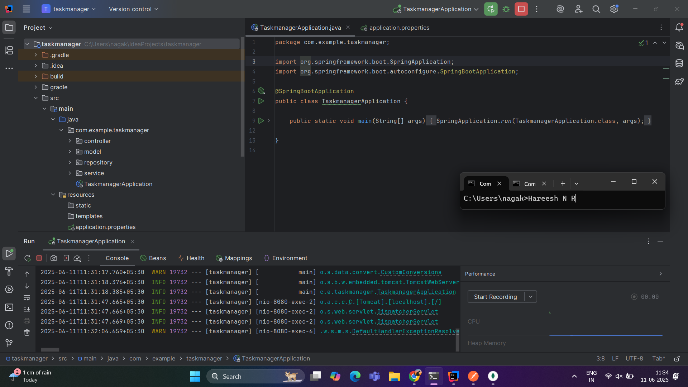
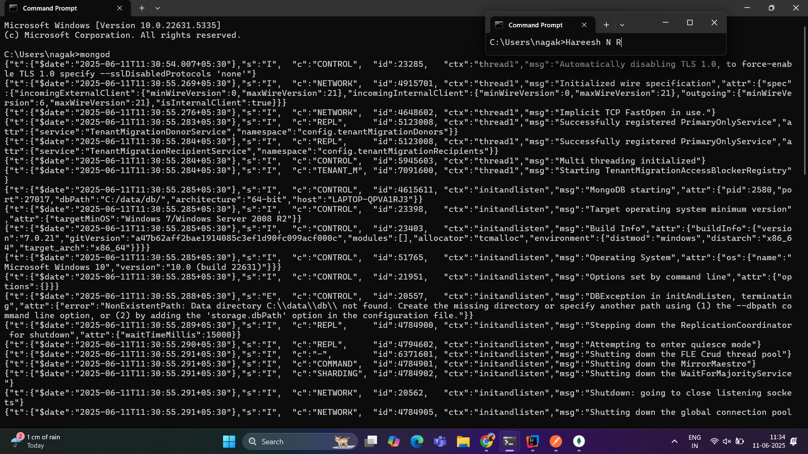
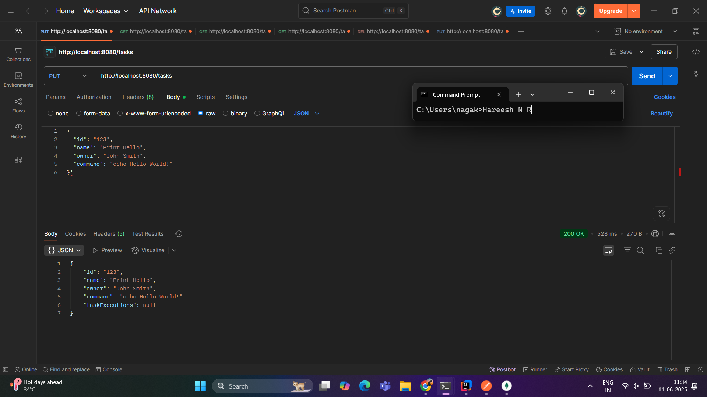
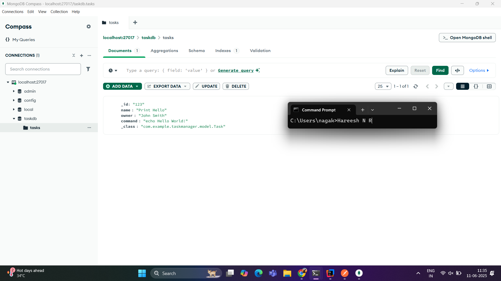

# Java-Backend-and-REST-API (Java + Spring Boot + MongoDB)

##  Table Of Content

- Introduction

- Technologies & Tools Used

- Model Architecture

- How to Run

- Results

- Methodology

- Future Enhancements

- Author

## Introduction

This project implements a backend REST API that manages "Task" objects which represent shell commands that can be executed. Each task contains metadata such as task name, owner, and a list of previous executions. Task execution includes command output. The backend is powered by Spring Boot and uses MongoDB as the primary database.

---

## Technologies & Tools Used

- Java 17+
- Spring Boot
- Spring Data MongoDB
- MongoDB (Local installation or MongoDB Atlas cloud)
- Postman (for testing API endpoints)
- IntelliJ IDEA (for development)
- Gradle (build tool)

---

## Model Architecture

### Task Object Structure
```json
{
  "id": "123",
  "name": "Print Hello",
  "owner": "John Smith",
  "command": "echo Hello World",
  "taskExecutions": [
    {
      "startTime": "2023-04-21T15:51:42.276Z",
      "endTime": "2023-04-21T15:51:43.276Z",
      "output": "Hello World"
    }
  ]
}
```
---

# How to Run the Project

## Clone the Repository

git clone 
https://github.com/Hareesh202003/Java-Backend-and-REST-API.git
cd Text-Classification

## Prerequisites

Make sure the following tools are installed and properly configured:

- Java JDK 17+
- MongoDB (running locally via `mongod` or using MongoDB Atlas cloud cluster)
- IntelliJ IDEA 
- Postman (for API testing)

Ensure Java 17+ is being used. You can check with the below in command prompt:

java -version

## Start MongoDB

### Local Setup 

-Type this in command prompt:

```bash
mongod
```

-Run the Spring Boot Application
 Using IntelliJ IDEA
 Open the project.

 In the src/main/java/com/example/taskmanager/TaskManagerApplication.java file:
 
 -Right-click on the class.
 -Click Run 'TaskManagerApplication'.

-Test the API using Postman

 URL: http://localhost:8080/tasks
 Method: PUT
 Body (JSON):
 {
   "id": "123",
   "name": "Print Hello",
   "owner": "John Smith",
   "command": "echo Hello World",
 }
 Click Send.

-Finally check the MongoDB Compass App for the task completion.

---

## Methodology

- Modeled `Task` and `TaskExecution` as MongoDB documents using Spring Data MongoDB.
- Built RESTful endpoints using Spring Boot and Spring MVC.
- Executed shell commands securely using Java's `ProcessBuilder`.
- Used Gradle for dependency and build management.
- Verified the API using Postman, testing all CRUD operations and command execution.

---

## Results

-Tasks are successfully created, retrieved, updated, and deleted via REST API.
-Each task execution logs start time, end time, and output.
-MongoDB stores tasks and their execution logs.
-API endpoints tested successfully with Postman and curl.

## Application Screenshots

### 1. IntelliJ IDEA - Running Spring Boot Application



---

### 2. MongoDB - Running `mongod` in Terminal



---

### 3. Postman - PUT Task Request



---

### 4. MongoDB Compass (or Atlas Cluster) - Database View



---

## Future Enhancements

-Add JWT-based authentication and authorization.
-Add WebSocket support for real-time execution logs.
-Dockerize the app and deploy it on Kubernetes.
-Add validation to blacklist risky shell commands.
-Build a frontend (React/Angular) for UI-based task management.
-Add task scheduling using Spring Scheduler or Quartz.

---

##  Author

Name: Hareesh202003
GitHub: > [https://github.com/Hareesh202003/Java-Backend-and-REST-API]{.underline}
Date:11/06/2025

---
